# HomeCWB: 氣象資料與智慧家庭自動化
將氣象開放資料整合進 HomeKit 智慧家庭生態系的解決方案。使用 ESP32 微控制器即時存取氣象開放資料，並與 HomeKit 建立溝通橋樑，達到開放資料與智慧家庭的整合。

## 資料創新應用競賽­
本專案為 Jia Studio 於 2023 年參與`2023資料創新應用競賽 - 生活氣象多元應用組`之參賽作品

[資料創新應用競賽](https://opendata-contest.tca.org.tw/)

## 應用場景
`HomeCWB` 適用於家庭、公司、農業或畜牧業等各種場景。

例如:

- 家庭: 根據溫度/濕度自動啟動風扇/除濕機。
- 辦公室: 根據空氣品質資訊自動關閉窗戶並啟動空氣清淨機。
- 養殖漁業或畜牧業: 根據氣象資訊自動控制水泵或加熱設備。

## 功能
- 將氣象開放資料整合到 HomeKit 生態系中
- 可以在使用者所有蘋果裝置上同步並存取相關資料
- 使用者能直接透過 Siri 語音詢問相關資訊
- 以氣象資料為觸發條件，讓使用者能依照不同情境客製化智慧家電自動化控制

## 專案需求
1. ESP32 單晶片微控制器x1
2. Micro USB-USBA傳輸線x1
2. ESP32 開發環境設定 [第1-2.1節 ESP32 環境設定，於Arduino IDE 2 (2023年重拍版)](https://www.youtube.com/watch?v=PW_TOtyITk4)
2. 氣象資料開放平台 API 授權碼x1  [氣象資料開放平臺](https://opendata.cwb.gov.tw/)
3. 環保署環境資料開放平臺 API 授權碼x1 [環保署環境資料開放平臺](https://data.epa.gov.tw/)

## 使用方法
1. 下載本專案

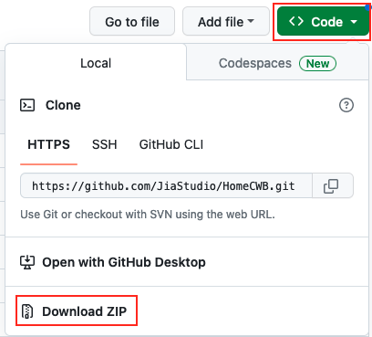

2. 將專案解壓縮後，以 Arduino IDE 開啟`ESP32-CWB.ino`檔案
3. 於 Arduino IDE 選擇`Manage Libraries`

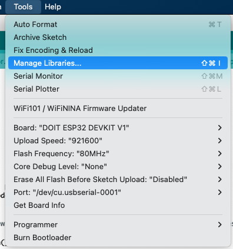

4. 輸入`HomeSpan`並安裝
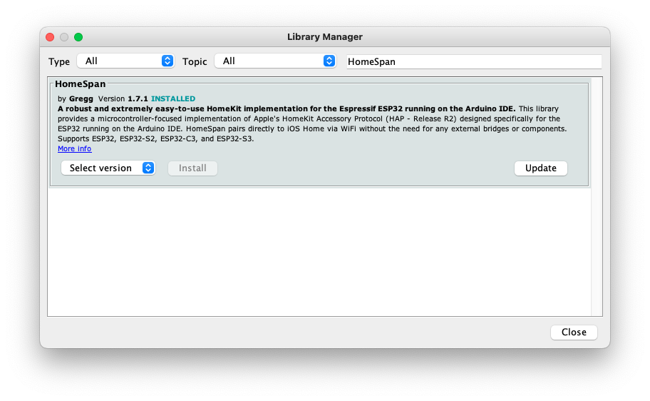
5. 於 Arduino IDE 選擇對應的 USB Port

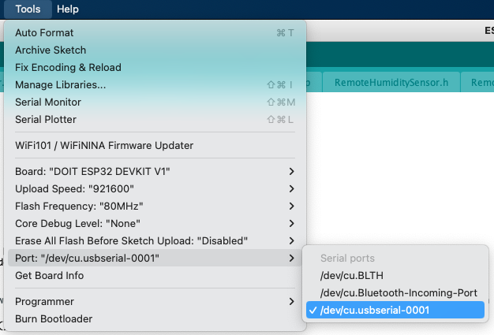

6. 開啟 Arduino IDE 中的`Serial Monitor`以方便查看訊息

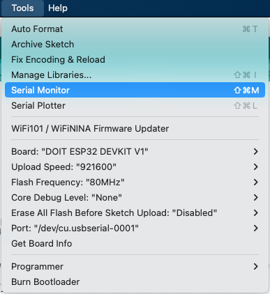

7. 依照您的環境與喜好修改`config.h`檔案內的參數並儲存

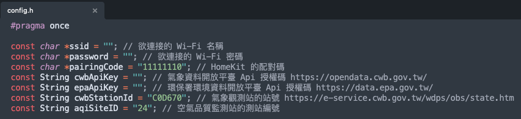

8. 點選 Arduino IDE 的上傳按鈕，將程式碼安裝至 ESP32 中

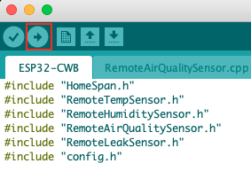

9. 等待上傳完成

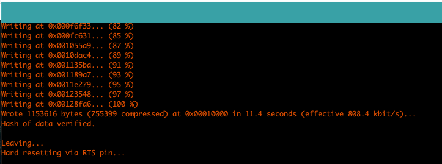

10. 等待 Serial Monitor 顯示 `DEVICE NOT YET PAIRED -- PLEASE PAIR WITH HOMEKIT APP`  等字樣
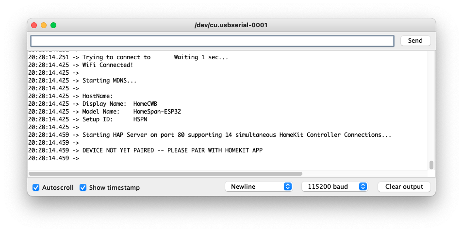
11. 打開 iPhone 中的`家庭`App
12. 選擇右上方 `+` 號並選擇`加入配件`

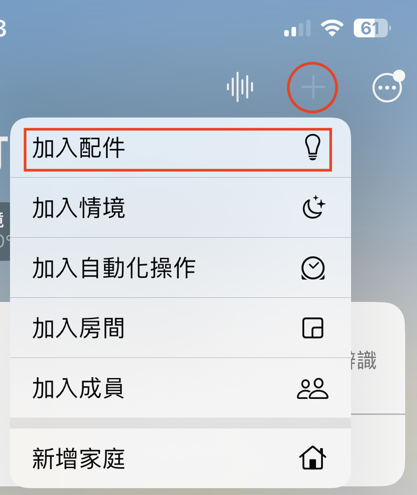

13. 選擇`更多選項`

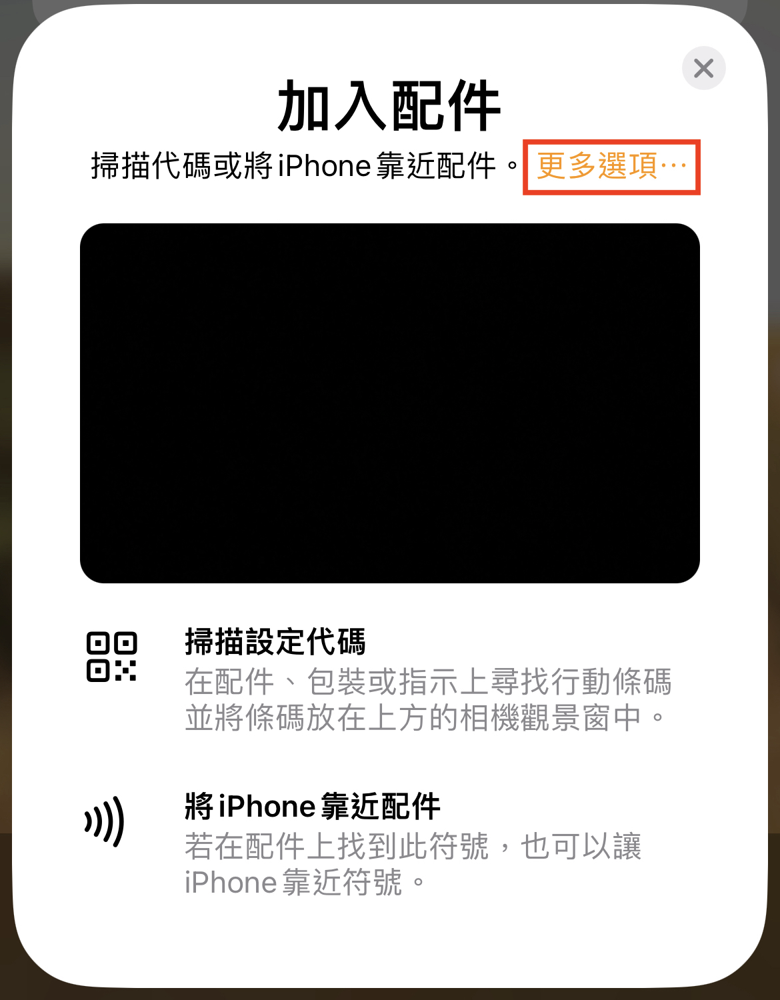

14. 選擇`HomeCWB `

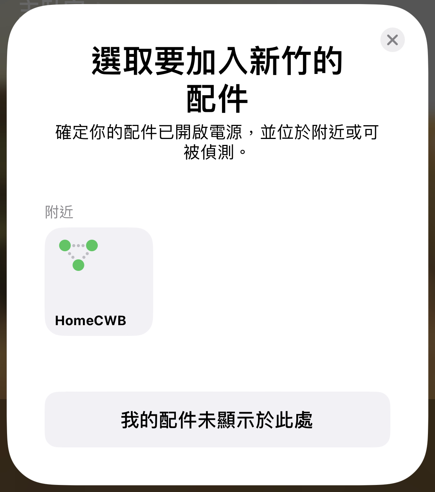

15. 輸入您在`config.h`所設定的`pairingCode`配對碼
16. 點選多次`繼續`直到完成
17. 等待初始化完成後，即成功將氣象開放資料導入 HomeKit

## 參與我們
如果你有任何問題、建議或者想法，歡迎通過 issue 或者 pull request 與我們交流。

## 外部資源
- [HomeSpan](https://github.com/HomeSpan/HomeSpan)

## 數據資料來源
- [自動氣象站-氣象觀測資料](https://opendata.cwb.gov.tw/dataset/observation/O-A0001-001)
- [自動雨量站-雨量觀測資料](https://opendata.cwb.gov.tw/dataset/observation/O-A0002-001)
- [空氣品質指標(AQI)](https://data.epa.gov.tw/dataset/detail/AQX_P_432)

## 授權條款
這個專案採用 MIT 授權條款，詳細內容請參考 [LICENSE](LICENSE) 文件。